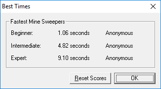

# minesweeper_x_auto_sweeping
Python program plays Minesweeper X in Windows. Not cheating like reading the application's memory, but grab the image, do the reasoning, and control the mouse action to solve the game.

## test run
Install python and the dependencies, including [mss](https://python-mss.readthedocs.io/en/dev/index.html), Pillow and win32api.

Open the Minesweeper X application, make sure the game window is not covered by other appications. Then navigate to this program folder in command line and run:

`python auto_minesweeper.py`

## benchmark
The finishing time is pretty consistent, 2 seconds for beginner, 5 seconds for intermediate, and 10 seconds for expert. The program hesitates a little when a large empty area is discovered, because image capturing is the most time consuming part. Since this repo is primarily a study of computerized minesweeping strategies, there is no further intention to improve on that delay.

It plays a custom game of 100x60 with 938 mines.

